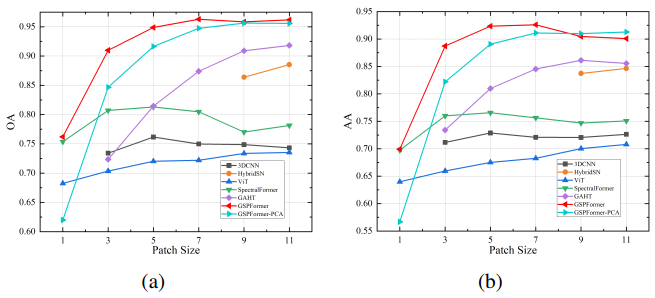

## Hyperspectral Image Classification based on Global Spectral Projection and Space Aggregation

This paper is accpeted by IEEE Geoscience and Remote Sensing Letters (GRSL) and can be downloaded [here](https://ieeexplore.ieee.org/document/10129937).


**Fig. 1** An overview framework of the proposed GSPFormer model for HSI classification. It consists of cascaded global spectral projection space (GSPS)
and space aggregation module (SAM). Spectral self-interaction (SSI) is used to expand each input spectrum for fully exploiting its global features.



**Fig. 2** OA and AA of our GSPFormer and state-of-the-art models at different patch sizes on Indian Pines. (a) OA. (b) AA.

### How to run our code

#### Data
Before running this code, you should download the widely used datasets(IndianPines, PaviaC, PaviaU and Salinas) and put them
in the file **Datasets**. The structure of the **Datasets** file:

-Datasets  
&ensp; --IndianPines  
&emsp; ----Indian_pines_corrected.mat  
&emsp; ----Indian_pines_gt.mat  
&ensp; --Salinas  
&emsp; ----Salinas_corrected.mat  
&emsp; ----Salinas_gt.mat  
&ensp; --PaviaC  
&emsp; ----Pavia.mat  
&emsp; ----Pavia_gt.mat


#### Code
Please run the **demo_train.py** and **pred.py**

```
python demo_train.py -d IN -p 7 -ip False
python pred.py -d IN -p 7 -ip False
```

### References

The code of our GSPFormer is based on the implementations of [HybrisdSN](https://github.com/purbayankar/HybridSN-pytorch) and [SpectralFormer](https://github.com/danfenghong/IEEE_TGRS_SpectralFormer).


### Citation

D. Chen, J. Zhang, Q. Guo and L. Wang, "Hyperspectral Image Classification based on Global Spectral Projection and Space Aggregation," in IEEE Geoscience and Remote Sensing Letters, doi: 10.1109/LGRS.2023.3277841.
# GSPFormer
